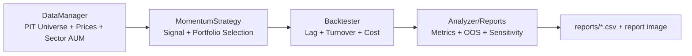

# S&P 500 Sector Momentum Strategy

一個可回測、可 API 化、可用簡易前端操作的 S&P 500 板塊動量輪動專案。

本專案包含兩條主線：
- **Backtest 線**：用歷史資料評估策略表現（含 SPY / SPMO / SPX 比較）。
- **Live Portfolio 線**：用當前動量信號產生建議持倉，並以本地 `portfolio.json` 管理買賣紀錄。

## 0. TL;DR（30 秒快速了解）

如果你只想先跑一次完整研究流程，直接執行：

```bash
python build_sector_aum_csv.py --years 20
python full_backtest.py --years 20 --no-plots
python walk_forward.py --years 20 --train-months 36 --test-months 12
python sensitivity_backtest.py --years 20
```

看這三個輸出檔即可快速判斷策略：

- `reports/backtest_metrics.csv`：總績效/風險/基準比較
- `reports/walk_forward_report.csv`：樣本外穩健性
- `reports/sensitivity_report.csv`：參數與成本脆弱度

### 0.1 專案流程圖



### 0.2 這個專案是什麼 / 不是什麼

| 類型 | 說明 |
|---|---|
| 是什麼 | 研究型量化回測框架（可重現、可審計） |
| 不是什麼 | 自動交易執行系統、保證獲利策略 |
| 主要用途 | 研究策略邏輯、檢查偏誤、驗證穩健性 |
| 風險提醒 | 高報酬不代表可實盤，需先看 OOS 與風險指標 |

---

## 1. 專案目標

- 用 4W / 13W / 26W 動量因子，從各板塊挑選強勢股票。
- 用 Sector ETF 權重決定板塊曝險，組成跨板塊投資組合。
- 提供完整回測與風險指標（Sharpe、Sortino、MDD、Calmar 等）。
- 提供 Flask API + 單頁前端，支援：
  - 初始建倉
  - 月度調倉（含部分加減碼）
  - 交易歷史查詢
  - 快取管理

---

## 2. 策略邏輯（核心）

### 2.1 動量分數

對每檔股票計算：

```
Momentum = (Ret_21d + Ret_63d + Ret_126d) / 3
```

其中：
- 21 交易日約 4 週
- 63 交易日約 13 週
- 126 交易日約 26 週

### 2.2 選股方式

- 每個板塊內依動量排序。
- 選 `TOP_N_PER_SECTOR` 檔（預設為 1，見 `config.py`）。
- 回測預設啟用 `point-in-time universe`，按月回推當時可投資成分股。

### 2.3 板塊權重

- 板塊集合來自 11 檔 SPDR Sector ETF（XLC, XLY, ...）。
- 權重計算方式：
  - 優先使用 ETF `totalAssets`（AUM）作為基礎。
  - 再以每月 ETF 價格相對起始月變化，推進 proxy AUM。
  - 每月再 normalize 成權重。

> 註：這是「AUM 基底 + 價格推進」的動態近似，不是逐月歷史真實 AUM 還原。

若你有真實月度 AUM，可放在 `data/sector_aum_monthly.csv`，系統會優先使用。
欄位格式：`date` + 11 個 sector 欄位（欄名需與 `SECTOR_ETFS` 的 sector 名稱一致）。

### 2.7 資料與偏誤控制對照表（建議先讀）

| 資料項目 | 目前來源 | 主要風險 | 控制方式 |
|---|---|---|---|
| S&P500 Universe | PIT 月度回推 | 存活者偏誤 | 預設啟用 `use_point_in_time_universe` |
| 股票歷史價格 | Yahoo Finance | 缺值/調整口徑 | 快取 + 缺值處理 + 測試 |
| 板塊權重 | 本地 `data/sector_aum_monthly.csv` 優先 | 權重前視偏誤 | 預設 `REQUIRE_LOCAL_SECTOR_AUM_FOR_BACKTEST=True` |
| AUM fallback | current AUM + 價格推進 | 使用未來資訊 | 僅在明確允許時使用，且需揭露 |
| 交易成本 | 固定 cost + slippage | 低估實盤衝擊 | sensitivity 測試成本上調 |

### 2.4 組合建構

- 板塊內採等權分配。
- 若部分板塊無可用股票（例如動量為 NaN），總權重可能小於 100%，差額視為現金。

### 2.5 再平衡與成本

- 回測使用 **月度再平衡**。
- 預設使用 `execution_lag_months=1`（月頻 T+1 代理）。
- 扣除交易成本 + 滑價（見 `config.py`）。

### 2.6 暖機期

- 前 7 個月不交易（確保 26 週動量資料可用）。

---

## 3. Stop Loss（可選）

`stop_loss.py` 支援：
- 個股停損：相對買入價（預設 -12%）
- 追蹤停損：相對歷史高點（預設 -15%）
- 組合風控：
  - REDUCE（預設回撤 -10%）
  - HALT（預設回撤 -15%）

檢查頻率可選 `daily` / `weekly` / `monthly`。

---

## 4. 專案結構

```text
.
├── api.py                         # Flask app factory + routes
├── index.html                     # 單頁前端
├── scripts/                       # 主要 CLI / backtest 腳本
│   ├── full_backtest.py
│   ├── walk_forward.py
│   ├── sensitivity_backtest.py
│   ├── build_sector_aum_csv.py
│   ├── today_buy.py
│   ├── main.py
│   └── fmp_tools.py
├── services/
│   ├── market_data_service.py     # 資料載入與即時價格
│   ├── signal_service.py          # 最新策略信號組裝
│   ├── portfolio_repository.py    # portfolio.json 存取邊界
│   ├── portfolio_service.py       # 持倉、調倉、交易落地
│   └── backtest_service.py        # 回測 orchestration + API payload
├── strategy.py                    # 動量計算、選股、權重配置
├── backtester.py                  # 回測主引擎
├── analyzer.py                    # 績效指標與視覺化
├── stop_loss.py                   # 停損與風控
├── data_manager.py                # 市場資料下載與板塊權重
├── cache_manager.py               # 本地快取管理
├── fmp_adapter.py                 # FMP API adapter
├── env_config.py                  # .env / 環境變數讀取
├── config.py                      # 全域參數設定
├── docs/
│   ├── ARCHITECTURE.md            # 架構設計與 request flow
│   ├── MAINTENANCE.md             # 維運與修改指南
│   ├── PRIORITY_FIXES.md          # 高優先修正與原因說明
│   └── STRATEGY_PLAYBOOK.md       # 策略技術文件
├── tests/
│   ├── test_core.py               # 核心邏輯測試
│   └── test_all.py                # 單元/整合測試
├── data/                          # 本地資料與 AUM CSV
├── portfolio.json                 # Live 組合與交易歷史（本地持久化）
└── cache/                         # 快取資料（pkl）
```

> 相容性：根目錄仍保留同名 wrapper（例如 `python full_backtest.py`），內部會轉發到 `scripts/`。

建議先讀：`docs/ARCHITECTURE.md`、`docs/MAINTENANCE.md`、`docs/PRIORITY_FIXES.md`

---

## 5. 環境需求

- Python 3.10+
- 可連網（抓 Yahoo Finance / Wikipedia 時需要）

安裝：

```bash
pip install -r requirements.txt
```

建立本機環境變數檔（不要提交真實金鑰）：

```bash
cp .env.example .env
```

PowerShell 也可用：`Copy-Item .env.example .env`

接著在 `.env` 填入：

```env
FMP_API_KEY=your_real_key_here
```

專案已支援從 `.env` 讀取 `FMP_API_KEY`。

`requirements.txt` 主要套件：
- yfinance
- pandas
- numpy
- matplotlib
- requests
- flask
- flask-cors
- lxml

---

## 6. 快速開始

### 6.0 5 分鐘上手（建議照順序）

1. 安裝依賴：`pip install -r requirements.txt`
2. 啟動服務：`python api.py`
3. 開啟：`http://localhost:5000`
4. 在 `Live Portfolio` 頁按 **Generate This Month's Buy Signals**，再按 **Confirm Buy** 建立初始組合
5. 切到 `Rebalance` 頁按 **Compare & Suggest Rebalance**，確認後按 **Execute Rebalance**
6. 切到 `Trade History` 頁確認交易紀錄
7. 若要看策略歷史表現，使用 `python full_backtest.py`

### 6.0b 回測前必做（重要）

本專案現在預設採用「本地月度板塊 AUM 檔」進行回測，以降低權重端前視偏誤。

```bash
# 嚴格模式：只接受 shares*price，可避免 fallback 到 proxy
python build_sector_aum_csv.py --years 20 --no-proxy-fallback

# 一般模式：shares*price 若不足，允許 proxy fallback（會在輸出警告）
python build_sector_aum_csv.py --years 20
```

完成後確認 `data/sector_aum_monthly.csv` 已更新，再跑回測。

### 6.0c 指令速查表（研究常用）

| 目的 | 指令 | 主要輸出 |
|---|---|---|
| 建 20 年 AUM 檔 | `python build_sector_aum_csv.py --years 20` | `data/sector_aum_monthly.csv` |
| 全歷史回測 | `python full_backtest.py --years 20 --no-plots` | `reports/backtest_metrics.csv` |
| OOS 驗證 | `python walk_forward.py --years 20 --train-months 36 --test-months 12` | `reports/walk_forward_report.csv` |
| 敏感度掃描 | `python sensitivity_backtest.py --years 20` | `reports/sensitivity_report.csv` |
| 全量測試 | `python test_all.py` | 17/17 tests pass |

### 6.1 跑完整回測（推薦）

先建立本地月度板塊 AUM 檔（離線回測模式）：

```bash
python build_sector_aum_csv.py --years 10
```

預設回測會要求 `data/sector_aum_monthly.csv` 存在且可解析。

```bash
python full_backtest.py
python full_backtest.py --years 5
python full_backtest.py --years 10 --stop-loss
python full_backtest.py --years 10 --no-plots
python full_backtest.py --years 20
python full_backtest.py --years 10 --allow-proxy-sector-aum
```

建議做 20 年標準流程：

```bash
python build_sector_aum_csv.py --years 20
python full_backtest.py --years 20 --no-plots
python walk_forward.py --years 20 --train-months 36 --test-months 12
python sensitivity_backtest.py --years 20
```

> 如需關閉 point-in-time universe（不建議），可使用 `--no-pit`。
> 如需在本地 AUM CSV 缺失時允許 proxy fallback，可使用 `--allow-proxy-sector-aum`。

### 6.1b 20 年回測驗收清單（建議）

- `data/sector_aum_monthly.csv` 時間範圍涵蓋 20 年（至少與回測區間對齊）
- `full_backtest.py` 輸出中，策略/benchmark 起訖日期一致
- `reports/walk_forward_report.csv` 不只看平均，需檢查最差窗口（負報酬與回撤）
- `reports/sensitivity_report.csv` 在合理成本區間下仍維持可接受績效
- 最大回撤（MDD）與回復期需符合你可承受的實盤風險

輸出：
- `reports/backtest_report.png`
- `reports/backtest_metrics.csv`

### 6.2 互動式回測

```bash
python main.py
```

### 6.2b Walk-forward 穩健性檢查

```bash
python walk_forward.py
python walk_forward.py --years 12 --train-months 36 --test-months 12
```

輸出：
- `reports/walk_forward_report.csv`

### 6.2c 參數敏感度掃描

```bash
python sensitivity_backtest.py
python sensitivity_backtest.py --years 10
```

輸出：
- `reports/sensitivity_report.csv`

### 6.3 產生今日買入清單

```bash
python today_buy.py
python today_buy.py --capital 50000
```

### 6.3b FMP Adapter 測試與匯出工具

```bash
python fmp_tools.py search --query apple --limit 5
python fmp_tools.py quote --symbol AAPL
python fmp_tools.py export-sector-aum --years-back 5 --output data/sector_aum_monthly.csv
```

> `export-sector-aum` 使用「current assets + historical price」推進 proxy AUM。
> 若帳號方案不含該歷史端點，工具會提示 plan limit 並跳過輸出。

### 6.4 啟動 API + 前端

```bash
python api.py
```

開啟瀏覽器：
- `http://localhost:5000`

---

## 7. API 概覽

### 系統與快取

- `GET /api/health`：健康檢查
- `GET /api/cache/info`：查看快取檔
- `POST /api/cache/clear`：清空快取

### 回測

- `POST /api/backtest`

Request body 範例：

```json
{
  "years_back": 10,
  "top_n": 1,
  "use_stop_loss": false,
  "stock_stop_loss": -0.12,
  "trailing_stop": -0.15,
  "portfolio_stop_loss": -0.10,
  "portfolio_halt": -0.15,
  "check_frequency": "weekly",
  "execution_lag_months": 1,
  "use_point_in_time_universe": true,
  "require_local_sector_aum": true,
  "transaction_cost": 0.001,
  "slippage_cost": 0.0005
}
```

### Live Portfolio

- `GET /api/portfolio/holdings`：目前持倉與未實現損益
- `GET /api/portfolio/signals`：最新策略建議持股
- `POST /api/portfolio/buy`：確認初始建倉
- `GET /api/portfolio/rebalance`：比較舊持倉與新信號（含加減碼）
- `POST /api/portfolio/confirm-rebalance`：執行調倉
- `GET /api/portfolio/history`：交易歷史
- `POST /api/portfolio/reset`：重置本地組合

### 價格查詢

- `GET /api/stock-prices?tickers=AAPL,MSFT,NVDA`

---

## 8. Live Rebalance 執行規則

`/api/portfolio/rebalance` 會：
- 先估算目前總資產（持股市值 + 現金）。
- 依新權重換算每檔 target shares。
- 整股交易下若目標金額買不起 1 股，該標的留現金、不重分配。
- 與 current shares 比較後分成：
  - `SELL`：需要減碼（含全賣與部分賣）
  - `BUY`：需要加碼（含新買與部分買）
  - `HOLD`：股數不變
- 若價格不可得，會先回退到歷史最新收盤；仍不可得則列為 `skipped_no_price`。

`/api/portfolio/confirm-rebalance` 會：
- 支援部分賣出（不會一律整檔刪除）。
- 同 ticker 加碼時合併持倉，更新加權平均成本。
- 遇到無效價格/股數會跳過。
- 若現金不足，該筆買單會跳過。

### 8.1 前端按鈕對應（避免操作混淆）

- `Live Portfolio` Tab
  - `Generate This Month's Buy Signals`：產生本月候選與建議股數
  - `Confirm Buy`：把建議單寫入 `portfolio.json`
- `Rebalance` Tab
  - `Compare & Suggest Rebalance`：計算 SELL/BUY/HOLD（不落單）
  - `Execute Rebalance`：把目前建議單實際寫入交易歷史
- `Trade History` Tab
  - 檢視所有 BUY/SELL 紀錄與損益

---

## 9. 快取機制

`cache_manager.py` 會將資料存到 `cache/`：
- `sp500_components.pkl`
- `stock_prices_<start_date>.pkl`
- `sector_weights_<start_date>.pkl`
- `benchmark_<start_date>.pkl`

預設快取有效期 24 小時，超過後會重新抓取。

---

## 10. 測試

### 核心邏輯測試（推薦先跑）

```bash
python test_core.py
```

### 全量測試

```bash
python test_all.py
```

---

## 11. 重要設定（`config.py`）

- `START_CAPITAL = 30000`
- `TRANSACTION_COST = 0.001`
- `SLIPPAGE_COST = 0.0005`
- `SECTOR_AUM_CSV = "data/sector_aum_monthly.csv"`
- `REQUIRE_LOCAL_SECTOR_AUM_FOR_BACKTEST = True`
- `TOP_N_PER_SECTOR = 1`
- `MOMENTUM_4W = 21`
- `MOMENTUM_13W = 63`
- `MOMENTUM_26W = 126`

可依需求調整，但請同步理解：
- `TOP_N` 變大會提高分散度，也會影響換手與成本。
- 交易成本變高時，月頻策略績效會更敏感。

---

## 12. 目前限制與注意事項

- 資料依賴 Yahoo Finance，可能受 API 變動或限流影響。
- `point-in-time universe` 由 Wikipedia 變更表回推，屬高可用近似，非商業級官方 PIT 資料庫。
- ETF 權重採近似法（AUM 基底 + 價格推進），非逐月真實 AUM 還原。
- 若使用 `build_sector_aum_csv.py --no-proxy-fallback`，可優先使用 `sharesOutstanding * close` 的月度近似；但 Yahoo shares 資料仍可能不完整。
- Live Portfolio 目前使用本地 JSON 持久化（非資料庫）。
- 回測與 Live 執行是兩條流程；Live 需要手動確認交易。

---

## 14. 策略文件

已提供完整策略技術文件：

- `docs/STRATEGY_PLAYBOOK.md`

內容包含：資料來源、訊號與權重設計、偏誤控制、回測流程、風控、20 年驗證標準、實盤落地前檢查清單。

---

## 13. 建議工作流

1. 先跑 `python full_backtest.py --years 10` 看整體策略特性。
2. 調整 `config.py` 的 `TOP_N_PER_SECTOR`、成本或停損參數後重跑。
3. 啟動 `python api.py`，在前端做模擬建倉與月度調倉。
4. 定期清 cache 後重跑，確認資料更新對結果的影響。
